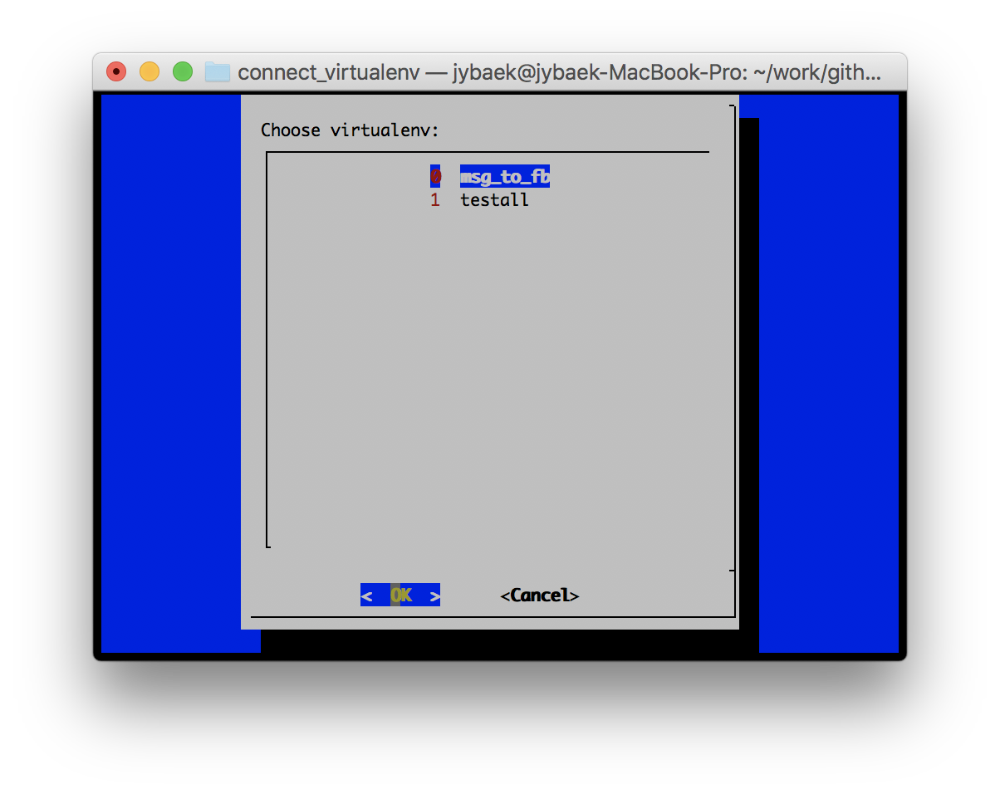

# Connect virtualenv
Helping you easily switch to a `virtualenv`.

## Usage
Put the `virtualenv` in a specific directory. 
Then, register the path as `ENV_PATH` in the source code.
After that make sure to alias connect_virtualenv as shown below.

```bash
$ alias .connect='source ~/bin/.connect_virenv'
```

Then reconnect the terminal and run alias.
```bash
$ .connect
```

You can select a virtual environment as follows:

<div style="width:50%; margin:auto; margin-bottom:10px; margin-top:20px;">

</div>

All you have to do is put your `virtualenv` in a specific directory.
